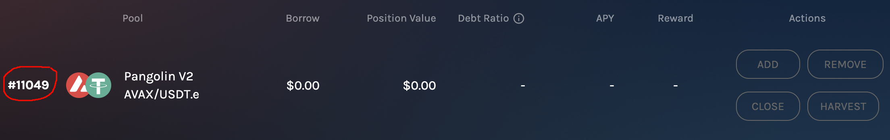
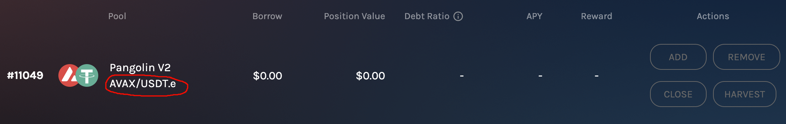
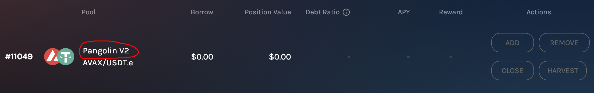

<!-- PROJECT HEADER -->
<div align="center">
  <a href ="https://homora-v2.alphaventuredao.io/"></a>
  <br></br>
  <h2 align="center"><strong>Alpha-Homora-V2-Python</strong></h2>
    <p align="center">
        A Python3.9+ package that models open Alpha Homora V2 positions to simplify interaction with their smart contracts in your Python projects.
    </p>
    <h3><strong>Current Features</strong></h3>
    <i>Get Rewards Value | Get Position Value | Get Debt Ratio | Get LP Info | <del>Get Current APY</del></i><br>
    <i>Harvest Rewards | Close Position</i><br>
    <h3><strong>Current Supported Networks</strong></h3>
    <i>Avalanche</i><br>
    <i><del>Ethereum</del> (WIP)</i><br>
</div>
<br>

<!-- TABLE OF CONTENTS -->
### Table of Contents
<details>
  <ol>
    <li><a href="#installation">Installation</a></li>
    <li><a href="#usage">Usage</a></li>
    <li><a href="#uninstallation">Uninstallation</a></li>
    <li><a href="#feature_roadmap">Roadmap</a></li>
  </ol>
</details>

## Installation

This package is set up to be installed using the `pip` package manager.

1. Ensure that you have Python 3.9+ installed. If not, you can download [here](https://www.python.org/downloads/release/python-3912/). The syntax is dependent on features added in this recent version.

2. Install the package using pip (you must use the git+url as this project is private and not listed on PyPi):
    ```bash
    pip install git+https://github.com/PathX-Projects/Alpha-Homora-V2-Python.git
    ```

    ***Note:*** You may need to provide your git credentials depending on the repository privacy settings. In the event, if you need help generating a personal access token see [here](https://catalyst.zoho.com/help/tutorials/githubbot/generate-access-token.html)

3. After install, the package will be available to you in your local Python environment as ***alpha_homora_v2***

When updates are made to the package, the version will automatically be incremented so that in order to get the newest version on your end, you can simply use the same installation command and your pip will detect and update to the newest version.

## Usage

How to use the package:

### For Avalanche Positions:

1. Import the package into your Python script:
    ```python
    from alpha_homora_v2.util import get_web3_provider
    from alpha_homora_v2.position import AvalanchePosition
    ```

2. **(Optional)** Create your Web3 provider object to interact with the network:
    ```python
    NETWORK_RPC_URL = "your_rpc_url"
    provider = get_web3_provider(NETWORK_RPC_URL)
    ```
3. Creating an [AvalanchePosition](alpha_homora_v2/position.py) instance requires the following:
    - Your position ID (an integer)
        - This ID should match your position on Alpha Homora, without the "#"
        - 
      
    <!--- DEPRECATED
    - The token symbol/pair (a string)
        - This parameter should exactly match the token symbol/pair displayed on your Alpha Homora as shown below.
        - 
    -->
    <!--- DEPRECATED
    - The DEX identifier (a string)
        - This parameter should exactly match the DEX identifier displayed on your Alpha Homora position as shown below.
        - 
    -->

    - your public wallet key
    - **(Optional)** your private wallet key
        - Your private key is required to sign transactional methods
    - **(Optional)** A web3 provider object
      - If none is passed, an HTTP provider will be created with the [default Avalanche RPC URL](https://api.avax.network/ext/bc/C/rpc)

    Once you've gathered all of these variables, you can create the position instance like this example below:
    ```python
    position = AvalanchePosition(
               position_id=11049,
               owner_wallet_address="0x...",
               owner_private_key="123abc456efg789hij...", # <- Optional - see step 4
               web3_provider=provider)  # <- Optional If you'd like to use a custom provider
    ```
4. Alternatively, get all open positions ([AvalanchePosition](alpha_homora_v2/position.py) objects) by owner wallet address:
   ```python
   from alpha_homora_v2.position import get_avax_positions_by_owner
   
   positions = get_avax_positions_by_owner(owner_address="owner_wallet_address",
                                           owner_private_key="owner_private_key", # <- Optional
                                           web3_provider=provider)  # <- Optional
   
   # NOTE: Passing the private key is optional, but required if you want to use transactional methods on the returned AvalanchePosition object(s).
   ```
5. Use your position instance(s) to interact with the Alpha Homora V2 position smart contracts on the network:
   - Informational Methods
     - Return JSON data
     - Private wallet key ***not required*** for use
     ```python
     # Get value of harvestable rewards:
     position.get_rewards_value()

     # Get current debt ratio:
     position.get_debt_ratio()

     # Get the current leverage ratio:
     position.get_leverage_ratio()

     # Get position value (equity, debt, and position value):
     position.get_position_value()

     # (WIP) Get current pool APY (Only returns trading and farmng APY)
     position.get_current_apy()

     # get LP pool info:
     position.pool
     ```
   - Transactional Methods:
     - Return a [TransactionReceipt](alpha_homora_v2/receipt.py) object upon success
     - Private wallet key ***required*** for use to sign transactions
     ```python
     # Harvest available rewards:
     position.claim_all_rewards()

     # Close the position:
     position.close()
     ```

## Uninstallation:

Uninstall the package like any other Python package using the pip uninstall command:
```bash
pip uninstall alpha-homora-v2
```

## Feature Roadmap:

- [ ] Avalanche:
    - [x] Get all open positions by owner wallet address
    - [x] Harvest Position Rewards
    - [x] Close Position
    - [x] Get position value of equity and debt
    - [x] Get current debt ratio
    - [x] Get outstanding rewards value in native rewards token and USD
    - [ ] Get current pool APY
    - [ ] Add Liquidity
    - [ ] Remove Liquidity
- [ ] Ethereum:
    - [ ] Harvest Position Rewards
    - [ ] Close Position
    - [ ] Get position value of equity and debt
    - [ ] Get current debt ratio
    - [ ] Get outstanding rewards value in native rewards token and USD
    - [ ] Get current pool APY
    - [ ] Add Liquidity
    - [ ] Remove Liquidity
